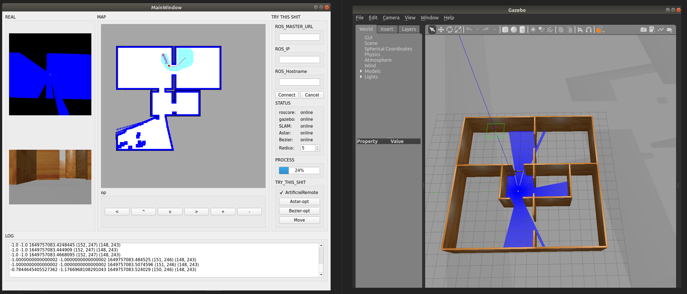
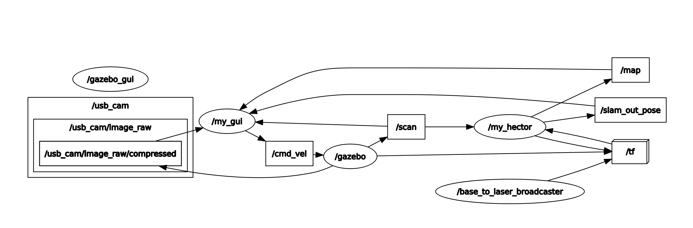

# mecanum_agv





## 0. Debug
roscore
roslaunch sim_gazebo room_world.launch
python3 /home/pi/ros/mecanum_agv/src/my_driver/scripts/ros_config.py
/home/hhc/anaconda3/envs/py39/bin/python /home/hhc/Desktop/ros/mecanum_agv/src/my_gui/scripts/main.py
## 1. env
- ubuntu18.04
- ROS-melodic
- python3.9
## 2. Init
```
git clone https://github.com/causehhc/mecanum_agv.git
cd mecanum_agv
catkin_make
source ./devel/setup.bash
```
## 3. Start simulation
### 3.1. Install something
```
pip install pyqt5 opencv-python-headless defusedxml netifaces pyyaml rospkg keyboard
```
### 3.2. start
```
roscore
roslaunch sim_gazebo room_world.launch
/home/hhc/anaconda3/envs/py39/bin/python /home/hhc/Desktop/ros/mecanum_agv/src/my_gui/scripts/main.py
```
## 4. Start realMachine
### 4.1. Bind USB_port
- sudo vim /etc/udev/rules.d/com_port.rules
- ls -l /sys/class/tty/ttyUSB*
```
ACTION=="add",KERNELS=="1-1.2.4",SUBSYSTEMS=="usb",MODE:="0777",SYMLINK+="ttyUSB_stm32"
ACTION=="add",KERNELS=="1-1.2.1",SUBSYSTEMS=="usb",MODE:="0777",SYMLINK+="ttyUSB_lidar"
```
- sudo udevadm trigger
- ll /dev | grep ttyUSB
### 4.2. Install something
```
sudo apt-get install ros-melodic-usb-cam
sudo apt install ros-melodic-image-transport-plugins
pip install pyserial rospkg defusedxml
```
### 4.3. start
`roslaunch my_driver start.launch`
### 4.4 Auto-start
- sudo vim /lib/systemd/system/rc-local.service
```
[Install]
WantedBy=multi-user.target
Alias=rc-local.service
```
- systemctl enable rc-local
- systemctl start rc-local
- sudo vim /etc/rc.local
```
#!/bin/bash
# TODO
exit 0
```
- sudo chmod +x /etc/rc.local
## 5. Need HardWare_Interface
- /usb_cam/image_raw/compressed
- /cmd_vel
- /scan