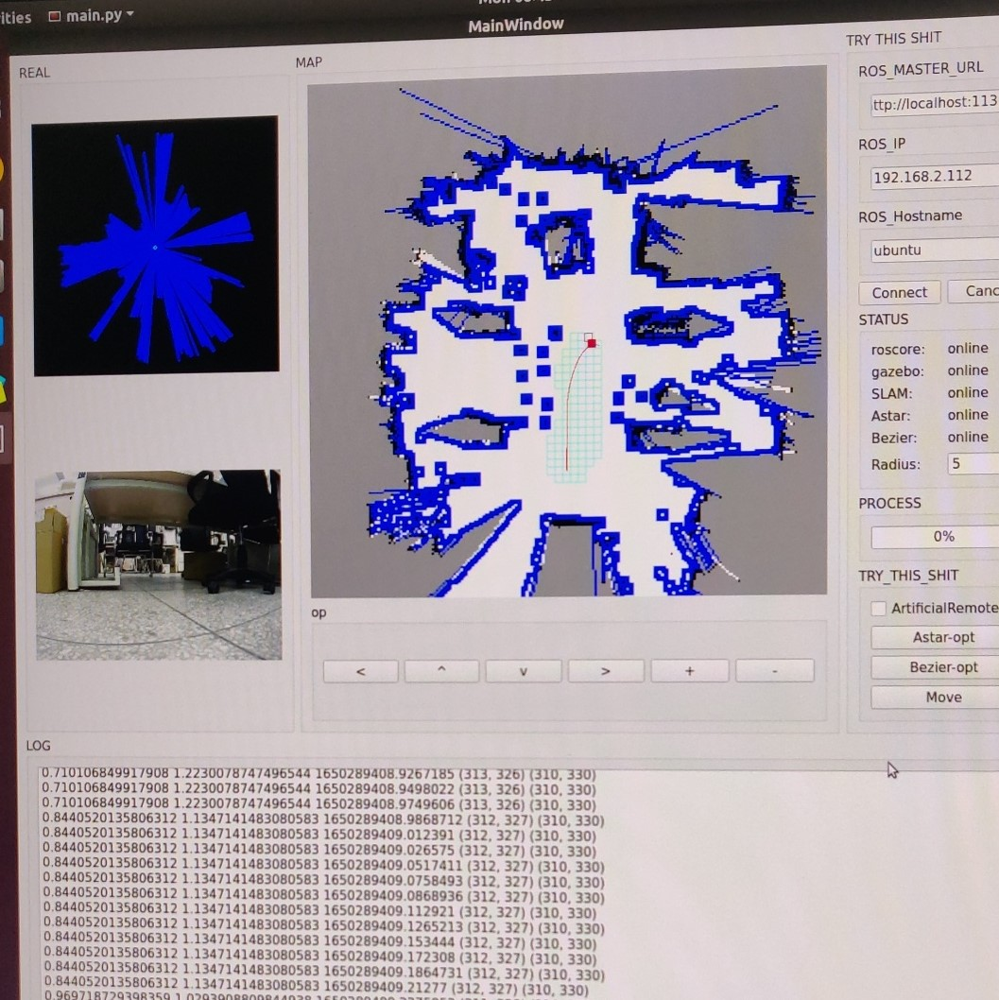

# mecanum_agv
## WARING: DEVELOPING



## Update
- opt interface_map
- lidar display_angle
## TODO
- Optimization A* heuristic function
## INIT
### 1.创建工作空间并初始化
```
git clone https://github.com/causehhc/mecanum_agv.git
cd mecanum_agv
catkin_make
```
### 2.run testNode
```
source ./devel/setup.bash
roslaunch sim_gazebo room_world.launch
```
## START
### 0.start realMachine
#### Bind USB_port
- sudo vim /etc/udev/rules.d/com_port.rules
- ls -l /sys/class/tty/ttyUSB*
```
ACTION=="add",KERNELS=="1-1.2.4",SUBSYSTEMS=="usb",MODE:="0777",SYMLINK+="ttyUSB_stm32"
ACTION=="add",KERNELS=="1-1.2.1",SUBSYSTEMS=="usb",MODE:="0777",SYMLINK+="ttyUSB_lidar"
```
- sudo udevadm trigger
- ll /dev | grep ttyUSB
#### Install something
`sudo apt-get install ros-melodic-usb-cam`
`sudo apt install ros-melodic-image-transport-plugins`
`pip install pyserial`
#### Start
`roslaunch my_driver start.launch`
#### test
`rosrun image_view image_view image:=/usb_cam/image_raw`
### 1.start room_world simulation
```
killall gzserver
roslaunch sim_gazebo room_world.launch
```
### 2.check rostopic
`rostopic list`
### 3.start remote car
`conda activate py39 && rosrun sim_gazebo remote_car.py`
### 4.start image view
`rosrun image_view image_view image:=/sim/smallCar/camera/image_raw`
### 5.start hector_mapping SLAM(NEED Third pkg)
`roslaunch my_gui hector_mapping_demo.launch`
### 6.It's time to get some realShit
`roslaunch my_gui hector_mapping_real.launch`
### 7.NAV
~~`roslaunch navigation test_amcl.launch`~~
### 8.Start GUI
`/home/hhc/anaconda3/envs/py39/bin/python /home/hhc/Desktop/ros/mecanum_agv/src/my_gui/scripts/main.py`

pip install opencv-python==4.3.0.38 -i https://pypi.tuna.tsinghua.edu.cn/simple

## Need HardWare_Interface
- /camera/image_raw/compressed
- /cmd_vel
- /scan